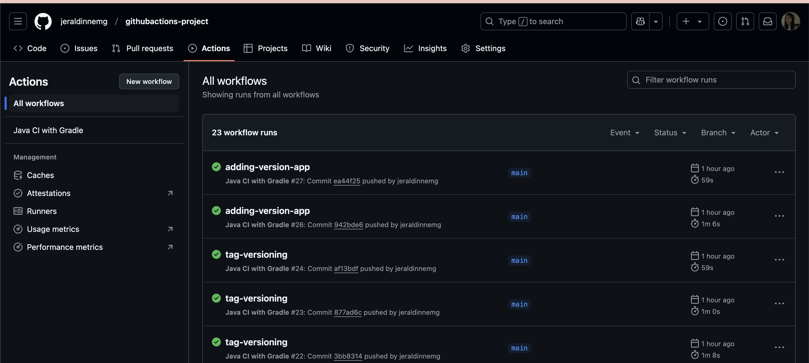
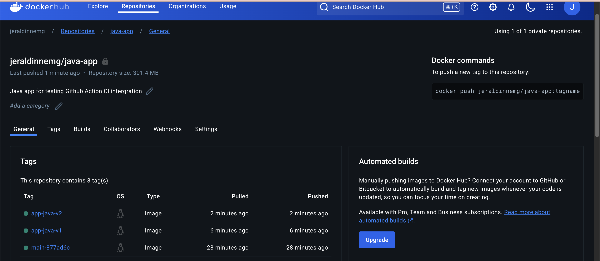
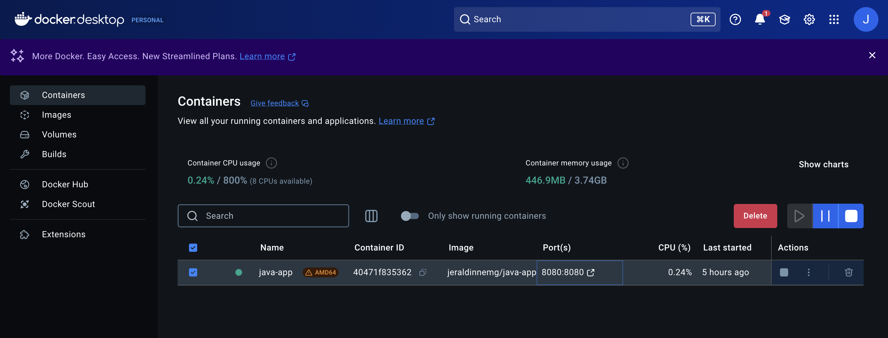
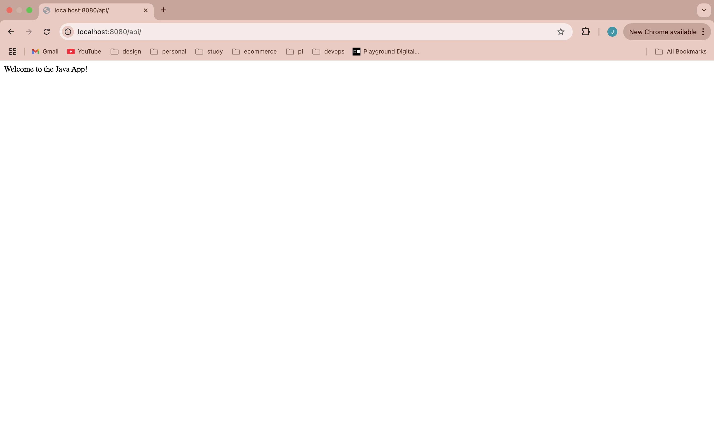

# GitHub Actions Tutorial: Automating CI/CD Workflows

This repository contains the implementation of a CI/CD pipeline using GitHub Actions, following a 
TechWorld with Nana tutorial that demonstrates the power of automation in modern software development.

## 🚀 Overview
GitHub Actions is a tool for automating developer workflows directly within your GitHub repository. It allows you to build, test, and deploy your code efficiently while leveraging GitHub's ecosystem.

### Key Concepts Covered:
1. **What is GitHub Actions?**
   - An overview of its purpose and benefits.
   - Examples of use cases for workflow automation.

2. **Core Components of GitHub Actions:**
   - **Events:** Triggers for workflows (e.g., `push`, `pull_request`, `schedule`).
   - **Actions:** Steps within a workflow (e.g., build, test, deploy).
   - **Workflows:** YAML files that define the sequence of actions.

3. **Why GitHub Actions for CI/CD?**
   - Integrated with your GitHub repository.
   - Simplifies the CI/CD process.
   - Supports custom workflows and reusable actions.

4. **Hands-on Demo:**
   - Building a CI pipeline for a **Java Gradle Project**.
   - Creating a Docker image.
   - Pushing the Docker image to a private DockerHub repository.

---

## 🔧 Prerequisites
To follow along or replicate this project, you need:

1. A GitHub repository.
2. A DockerHub account with a private repository.
3. Knowledge of YAML syntax (for the workflow file).
4. A basic understanding of Gradle and Docker.

---

## 📂 File Structure
```
my-project/
├── src/               # Source code of the Java project
├── Dockerfile         # Defines how to build the Docker image
└── .github/
    └── workflows/
        └── ci.yml    # GitHub Actions workflow file
```

---
## Application
- Github Actions
- Dockerhub Application
- Docker Desktop Container App
- JAVA App

---


## 🏃 How to Run the App Locally

To run this Java application using Docker, follow these steps:

1. **Pull the latest Docker image** from your DockerHub repository:
   ```sh
   docker pull jeraldinnemg/app-java-v2```
2. **Run the application container:** 
   ```sh
   docker run --platform linux/amd64 -d -p 8080:8080 --name java-app jeraldinnemg/java-app:app-java-v2```
3. **Verify that the container is running:** 
   ```sh
   docker ps```
4. **Test the application:** 
Open your browser and go to: http://localhost:8080/api/status

---
## 🔗 Related Resources
- [Github Actions Tutorial](https://www.youtube.com/watch?v=R8_veQiYBjI)
- [GitHub Actions Documentation](https://docs.github.com/en/actions)
- [Docker Documentation](https://docs.docker.com/)
- [Gradle Documentation](https://gradle.org/)

---

## 🤝 Contributing
Feel free to submit issues or pull requests to enhance this repository!

---

Thank you for checking out this tutorial implementation! Let me know if you have any questions or suggestions. 😊

